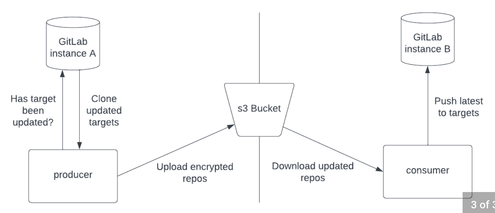

# Git Partition Sync
Keeping private repositories in sync across a network partition is a common problem that typically requires (recurring) manual intervention.

**Git Partition Sync** aims to automate this process by utilizing an s3 bucket as an intermediary for two applications: `producer` and `consumer`.

**Note:** currently only supports GitLab projects for sources


## Components
Both components have the following features:
* execute on loop indefinitely with user-defined sleep times
* `-dry-run` flag which causes the component to only output intended operations

### Producer
`producer` is tasked with cloning, tarring, encrypting, and uploading specified GitLab repositories to s3. `producer` formats the keys of uploaded objects as base64 encoded json for easy processing by `consumer`.

Refer to [producer's README](/producer/README.md) for further details.

### Consumer
`consumer` is tasked with downloading, decrypting, untarring, and pushing GitLab repositories to desired targets. 

Refer to [consumer's README](/consumer/README.md) for further details.

## Walkthrough

### Define target(s)
Adhering to the config file structure defined within [consumer's README](/consumer/README.md), create a yaml defining your desired targets. 

For this example we will define two project pairs for synchronizing:
```
- source:
    project_name: route-manager
    group: cloud-engineering
    branch: master
  destination: 
    project_name: routy
    group: ce
    branch: main
- source:
    project_name: terramorpher
    group: platform
    branch: fedramp
  destination: 
    project_name: terramorpher
    group: platfrom
    branch: master
```
Focusing on the first item, this definition is stating:  
 "copy the `master` branch of project `route-manager` within the `cloud-engineering` group to the `main` branch of project `routy` within the `ce` group.

### Configure s3 bucket and IAM
Create an s3 bucket to serve as the intermediary for the app components. The bucket does not need to be publicly accessible.

Generate credentials for an IAM user with permission s3 CRUD permissions.  
Note: `producer` requires CRUD permission but `consumer` can utilize a more restrictive set of credentials that only grant s3 read.

### Create an age x25519 key pair
[age](https://github.com/FiloSottile/age) x25519 format keys are utilized for encrypting/decrypting each repository. Follow age's README for generating a key pair.

### Execute producer
Refer to [producer's README](/producer/README.md) for execution command.  
If execution is successful, you will see new objects within the target s3 bucket with base64 encoded keys.  
If you decode one of these keys (be sure to omit file extension), you will obtain a json detailing information for one of your defined config file destinations, as well as a commit sha that will match the latest commit sha on the corresponding source repository.

### Execute consumer
Refer to [consumer's README](/consumer/README.md) for execution command.  
If execution is successful, the destination repositories will have the same commit history on the specified branches are their source counterparts.
